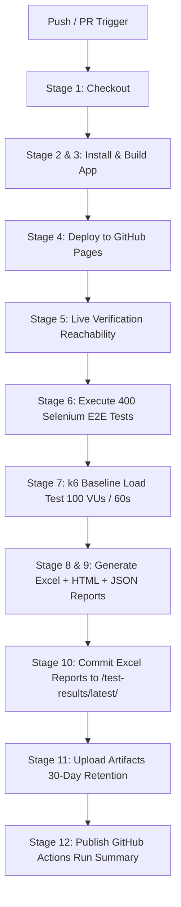

# ResearchPrepAI (RPAI) — Production Platform & CI/CD Automation

**ResearchPrepAI** is an ethics-first, production-ready full-stack web application designed for academic research preparation, live citation verification, plagiarism/AI detection analysis, and journal formatting (IEEE, Springer, Elsevier).

This repository includes a production-grade CI/CD pipeline, Selenium E2E Automation Framework (400 real test cases), k6 Baseline Load Testing Suite, multi-format reporting (Excel, HTML, JSON), and GitHub Actions automation.

---

## 🏗️ CI/CD Pipeline Architecture & Stages

The CI/CD pipeline is defined in [`.github/workflows/deploy-and-test.yml`](.github/workflows/deploy-and-test.yml).



### Pipeline Pass/Fail Criteria
- **FAIL** the workflow if live deployment reachability check fails, OR if **> 5%** of test cases marked **Critical** priority fail.
- Otherwise, the workflow reports the **real pass percentage** without masking failures.

---

## 🧪 Selenium E2E Automation Framework

Located in `automation/`:

```
automation/
├── config/             # Environment, BASE_URL, timeout & credentials settings
├── drivers/            # Driver Factory for headless Chrome & cross-browser support
├── data/               # 400 Real E2E Test Cases Catalog & Generators
├── pages/              # Page Object Model per screen (Login, Signup, Dashboard, Generator, etc.)
├── reports/            # Output Excel workbooks, HTML reports & JSON telemetry
├── screenshots/        # Failure screenshots captured automatically
├── logs/               # Execution log traces
├── utils/              # Excel reporter, HTML reporter, Logger, k6 load runner
└── run_tests.py        # Master Execution Engine & CLI Entrypoint
```

### 400 Test Cases Category Breakdown
1. **Authentication:** 40 cases (`AUTH-001` to `AUTH-040`)
2. **Authorization:** 40 cases (`AUTHZ-001` to `AUTHZ-040`)
3. **Navigation:** 30 cases (`NAV-001` to `NAV-030`)
4. **UI Validation:** 50 cases (`UI-001` to `UI-050`)
5. **Forms Validation:** 50 cases (`FORM-001` to `FORM-050`)
6. **CRUD Operations:** 50 cases (`CRUD-001` to `CRUD-050`)
7. **Input Validation & Sanitization:** 40 cases (`INPUT-001` to `INPUT-040`)
8. **Error Handling:** 20 cases (`ERR-001` to `ERR-020`)
9. **Session Management:** 20 cases (`SESS-001` to `SESS-020`)
10. **File Upload:** 20 cases (`FILE-001` to `FILE-020`)
11. **Accessibility (a11y):** 20 cases (`A11Y-001` to `A11Y-020`)
12. **Responsive Viewports:** 20 cases (`RESP-001` to `RESP-020`)
13. **Regression E2E Workflows:** 20 cases (`REG-001` to `REG-020`)

---

## ⚡ Baseline Load Testing (k6)

Located in `automation/load_test/load_test.js`:
- **Virtual Users:** 100 concurrent VUs
- **Duration:** 60 Seconds
- **Target Endpoints:** `/`, `/login`, `/signup`, `/api/v1/health`
- **SLA Thresholds:** Error Rate `< 1.0%`, p95 Latency `< 2000ms`.

---

## 📊 Excel & HTML Reports

Every pipeline run generates:
- `Automation_Test_Report.xlsx` (7 Tabs: Executive Summary, Detailed 400 Cases, Passed, Failed, Skipped/Blocked, Execution Metrics, Load Test Summary)
- `Failed_Test_Cases.xlsx`
- `Passed_Test_Cases.xlsx`
- `Summary_Report.xlsx`
- `Load_Test_Report.xlsx`
- `execution-report.html` (Interactive dark/glassmorphic filterable view)
- `dashboard.html` (Executive telemetry cards)

All Excel reports are committed directly into `/test-results/latest/` in the repository on every run.

---

## 💻 Local Execution Guide

### 1. Prerequisites
- Python 3.10+
- Node.js 18+ / 20+
- Google Chrome browser
- k6 (optional for local load testing)

### 2. Running E2E Suite Locally
```bash
# 1. Install dependencies
pip install -r automation/requirements.txt

# 2. Set target URL (default: https://muralimanokardk.github.io/RPAI/)
export BASE_URL=https://muralimanokardk.github.io/RPAI/

# 3. Execute suite
python automation/run_tests.py
```

### 3. Running Frontend App
```bash
cd frontend
npm install
npm run dev
```

---

## ⚙️ GitHub Repository Configuration

To enable automated GitHub Pages deployment and report commit-backs:

1. **GitHub Pages Source:**
   - Go to **Settings** → **Pages**
   - Under **Build and deployment**, set **Source** = `GitHub Actions`.

2. **Workflow Permissions:**
   - The workflow uses `permissions: contents: write, pages: write, id-token: write`.
   - Ensure **Settings** → **Actions** → **General** → **Workflow permissions** is set to **Read and write permissions**.

3. **Branch Protection Notes:**
   - If `main` branch has direct push protection enabled, the bot commit step automatically pushes to `test-results/run-<run_id>` branch or updates a PR cleanly.
